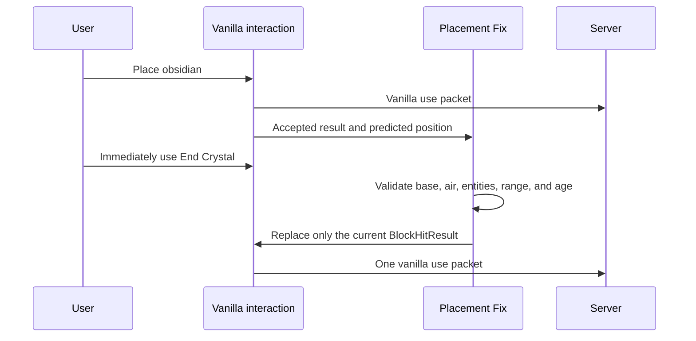

# KoHs Crystal Tweaks

KoHs Crystal Tweaks is a client-side Fabric mod for legitimate Crystal PvP quality-of-life improvements. It provides local visual prediction, seamless server reconciliation, crystal rendering controls, safety options, and version-specific compatibility from Minecraft 1.21 through 26.2.

[Modrinth project page](https://modrinth.com/mod/kohs-crystal-tweaks) · [GitHub releases](https://github.com/kerlycanelita/KoHs-Crystal-Tweaks/releases)

> Release 2.0.1 is built for Minecraft 1.21.10, 1.21.11, 26.1, 26.1.1, 26.1.2, and 26.2. The mod does not automate clicks, attacks, or placements.

Each release-2 JAR targets exactly the Minecraft version shown in its filename. Cross-version installation is rejected by Fabric before KoHs mixins or entrypoints load.

## Available builds

| Minecraft | Java | Internal mod version | Artifact |
|---|---:|---|---|
| 1.21–1.21.1 | 21 | `1.0.0+mc1.21` | `kohs-crystal-tweaks-1.0.0+mc1.21.jar` |
| 1.21.2–1.21.4 | 21 | `1.0.0+mc1.21.2` | `kohs-crystal-tweaks-1.0.0+mc1.21.2.jar` |
| 1.21.5 | 21 | `1.0.0+mc1.21.5` | `kohs-crystal-tweaks-1.0.0+mc1.21.5.jar` |
| 1.21.6–1.21.8 | 21 | `1.0.0+mc1.21.6` | `kohs-crystal-tweaks-1.0.0+mc1.21.6.jar` |
| 1.21.9 | 21 | `1.0.0+mc1.21.9` | `kohs-crystal-tweaks-1.0.0+mc1.21.9.jar` |
| 1.21.10 | 21 | `2.0.1+mc1.21.10` | `kohs-crystal-tweaks-2.0.1+mc1.21.10.jar` |
| 1.21.11 | 21 | `2.0.1+mc1.21.11` | `kohs-crystal-tweaks-2.0.1+mc1.21.11.jar` |
| 26.1 | 25 | `2.0.1+mc26.1` | `kohs-crystal-tweaks-2.0.1+mc26.1.jar` |
| 26.1.1 | 25 | `2.0.1+mc26.1.1` | `kohs-crystal-tweaks-2.0.1+mc26.1.1.jar` |
| 26.1.2 | 25 | `2.0.1+mc26.1.2` | `kohs-crystal-tweaks-2.0.1+mc26.1.2.jar` |
| 26.2 | 25 | `2.0.1+mc26.2` | `kohs-crystal-tweaks-2.0.1+mc26.2.jar` |

The 1.0.0 artifacts keep their original internal version and are distributed as GitHub pre-releases. Placement Fix starts with the 1.21.10 build.

## Main features

- **Local Crystal** renders accepted placements immediately on the client.
- **Seamless Mode** smooths the handoff from a predicted crystal to the real server entity.
- **Legitimate Crystal Optimizer** performs client-side visual cleanup after the player's normal vanilla attack; it never injects attacks.
- **Crystal Tint** provides separate frame and core colors.
- **Custom Sound** imports WAV, OGG, and MP3 explosion replacements on supported branches.
- **Safe Crystal** prevents accidental obsidian breaking while holding an End Crystal and can be switched off directly from `Tweaks`.
- **Placement Fix** on 1.21.10+ retargets only the current vanilla use to freshly predicted obsidian when the original crystal target is stale.
- **Ordered Crystal Input** on release 2 builds preserves the physical order of hotbar, attack, and use inputs from keyboard or mouse during a crystal cycle.
- **Rapid Attack Fix** on release 2 builds preserves one validated attack when a predicted crystal is clicked before its server entity arrives.

## Placement Fix (1.21.10+)

Placement Fix is enabled by default in the `Tweaks` tab. Disabling it opens a warning dialog:

- `Accept` disables the feature.
- `Restore` keeps the feature enabled.



Placement Fix does not create packets, repeat interactions, switch items, or select remote targets. If the original hit already points to a valid base, it remains unchanged.

On release 2 builds, the same toggle also fixes keyboard-place sequencing. Vanilla stores attack and use presses in separate counters, processes hotbar keys before both, and drains every attack before every use. This can make several physical actions received in one tick use only the final selected item. KoHs records number-key and mouse-wheel slot changes together with attack/use presses, then replays that exact sequence while consuming the corresponding vanilla click counters. Key repeat is ignored; no cooldown is removed and no action is synthesized.

Release 2.0.1 keeps an ordinary single attack or use entirely on Minecraft's direct input path. Ordered replay runs only for a multi-action or slot-sensitive same-tick sequence whose physical order vanilla could otherwise collapse. Outgoing attacks also clean up the matching real crystal independently of optional Local Crystal prediction, restoring immediate explosion feedback with the default Local Crystal OFF state.

The retarget is strictly causal. KoHs records a base only after vanilla returns an accepted obsidian placement. A crystal use that physically arrived first is never queued for later placement. If the original crystal hit already points to a valid base it stays untouched; otherwise only the recorded base or its exact placement offset can be substituted. Adjacent-block guessing was removed.

For new release 2 installations, `Local Crystal` and `Seamless Mode` are OFF by default. Enabling Local Crystal can display a prediction immediately, but a legitimate attack still has to wait until the server supplies the real crystal entity ID; KoHs never guesses that ID.

## Rapid Attack Fix (release 2)

Rapid Attack Fix is enabled by default in the `Tweaks` tab. It addresses the lost attack that can occur when left/right butterfly clicks overlap the prediction-to-server handoff:

- The normal vanilla attack must first pass its standard validation.
- If the crosshair still references the local prediction, the mod records one pending attack and deduplicates further rapid clicks.
- The attack is sent only after the matching real End Crystal and its server-assigned entity ID are available.
- The pending intent expires with the local prediction; the mod never guesses entity IDs or repeats attack packets.
- Outgoing real-crystal attacks are resolved by their packet entity ID, cleaned up immediately, and followed by a crosshair retrace that ignores removed and locally predicted crystals.
- An accepted local placement becomes the immediate crosshair target, so the next physical attack in the same client tick reaches the prediction instead of a stale block hit.

All option descriptions are shown as hover tooltips instead of fixed description blocks, keeping the configuration panel compact at high GUI scales.

Only the four timing-critical optimization toggles use an `Accept` / `Restore` confirmation: `Local Crystal`, `Seamless Mode`, `Placement Fix`, and `Rapid Attack Fix`. Consequences are shown first in English and then in Spanish. Visual, Sound, Safe Crystal, Static Crystal, and Crystal Flotation controls switch immediately.

## Safe Crystal switch (2.0.0)

`Safe Crystal` is disabled by default in `Tweaks`. When enabled, it cancels vanilla block attack and breaking-progress calls only when the player is holding an End Crystal and the targeted block is normal obsidian. Crying obsidian is no longer protected by this option.

The switch has no confirmation dialog. When disabled, both mixin callbacks return after the cached configuration check, before reading the player, world, held item, or block state. This restores vanilla block-breaking behavior for testing without changing crystal placement (`interactBlock`) or entity attacks (`attackEntity`). Compact configuration screens arrange the six Tweaks controls in two columns to keep them above the Close button.

## Intelligent incompatibility guard (release 2)

KoHs now checks for unsafe crystal-optimizer combinations before its gameplay mixins and runtime services are enabled. It blocks startup only when there is strong evidence:

- a known incompatible optimizer is loaded;
- another mod directly targets an internal KoHs class; or
- a crystal-related mixin targets the same class and exact timing-critical method as KoHs.

A shared Minecraft class by itself is not enough to trigger the guard. Unrelated mods and mixins that touch a different method continue normally.

When blocked, KoHs skips its mixins, prediction, sound, events, and compatibility payload registration. A mandatory English-first/Spanish-second screen identifies each mod by name, ID, and version, explains the technical reason, lists detected class/method points when available, and offers only `Close Minecraft / Cerrar Minecraft`. Escape and Mod Menu cannot bypass the screen.

Marlow's Crystal Optimizer is explicitly incompatible. A confirmed beta.5 startup log showed both mods registering `marlowcrystal:opt_out`, which Fabric rejects as a duplicate payload before the title screen. The beta.6 early guard prevents KoHs from performing that duplicate registration, allowing the explanatory screen to replace the crash.

## Prediction and rendering corrections

- Local prediction is created only after Minecraft accepts the interaction.
- The adaptive visual timeout starts at the configured 12 ticks instead of expiring early.
- Valid bases match vanilla: obsidian and bedrock; crying obsidian no longer creates a false prediction.
- Frame/core tint is selected when each registered `ModelPart` is actually rendered, avoiding queued-geometry duplication and mixed colors.
- The 26.x ports connect tint, spin speed, flotation, static crystal, and beam behavior to the submit-based renderer.
- Configuration panels, tabs, buttons, and the color picker stay inside the logical screen bounds at high GUI scales.

## Building

Each folder under `version/` is an independent Gradle project. For Java 21 branches:

```powershell
cd "version\1.21.10"
.\gradlew.bat clean build --no-daemon
```

Minecraft 26.x requires Java 25. Replace the folder with the exact target version:

```powershell
$env:JAVA_HOME='C:\Program Files\Java\jdk-25.0.2'
cd "version\26.2"
.\gradlew.bat clean build --no-daemon
```

Remapped JARs are written to `build/libs/`. Published artifacts were verified without launching a Minecraft client.

## Documentation

- [Technical investigation and decisions](docs/INVESTIGATION.md)
- [Changelog](CHANGELOG.md)
- [Per-version release notes](release-notes)
- [SHA-256 checksums](CHECKSUMS.sha256)

## License

KoHs Crystal Tweaks is licensed under the [MIT License](LICENSE).

Third-party MIT attributions are listed in [THIRD_PARTY_NOTICES.md](THIRD_PARTY_NOTICES.md).
