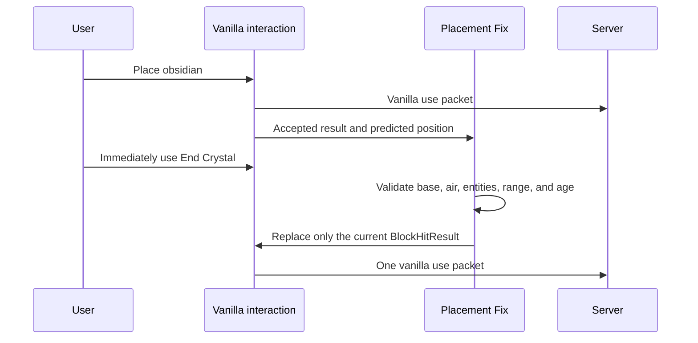

# KoHs Crystal Tweaks

KoHs Crystal Tweaks is a client-side Fabric mod for legitimate Crystal PvP quality-of-life improvements. It provides local visual prediction, seamless server reconciliation, crystal rendering controls, safety options, and version-specific compatibility from Minecraft 1.21 through 26.1.2.

> Release status: all downloadable builds are published through the GitHub **pre-release/beta** channel. The mod does not automate clicks, attacks, or placements.

## Available builds

| Minecraft | Java | Internal mod version | Artifact |
|---|---:|---|---|
| 1.21–1.21.1 | 21 | `1.0.0+mc1.21` | `kohs-crystal-tweaks-1.0.0+mc1.21.jar` |
| 1.21.2–1.21.4 | 21 | `1.0.0+mc1.21.2` | `kohs-crystal-tweaks-1.0.0+mc1.21.2.jar` |
| 1.21.5 | 21 | `1.0.0+mc1.21.5` | `kohs-crystal-tweaks-1.0.0+mc1.21.5.jar` |
| 1.21.6–1.21.8 | 21 | `1.0.0+mc1.21.6` | `kohs-crystal-tweaks-1.0.0+mc1.21.6.jar` |
| 1.21.9 | 21 | `1.0.0+mc1.21.9` | `kohs-crystal-tweaks-1.0.0+mc1.21.9.jar` |
| 1.21.10 | 21 | `1.1.0-beta.1+mc1.21.10` | `kohs-crystal-tweaks-1.1.0-beta.1+mc1.21.10.jar` |
| 1.21.11 | 21 | `1.1.0-beta.1+mc1.21.11` | `kohs-crystal-tweaks-1.1.0-beta.1+mc1.21.11.jar` |
| 26.1.2 | 25 | `1.1.0-beta.1+mc26.1.2` | `kohs-crystal-tweaks-1.1.0-beta.1+mc26.1.2.jar` |

The 1.0.0 artifacts keep their original internal version and are distributed as GitHub pre-releases. Placement Fix starts with the 1.21.10 build.

## Main features

- **Local Crystal** renders accepted placements immediately on the client.
- **Seamless Mode** smooths the handoff from a predicted crystal to the real server entity.
- **Legitimate Crystal Optimizer** performs client-side visual cleanup after the player's normal vanilla attack; it never injects attacks.
- **Crystal Tint** provides separate frame and core colors.
- **Custom Sound** imports WAV, OGG, and MP3 explosion replacements on supported branches.
- **Safe Crystal** prevents accidental block breaking while holding an End Crystal.
- **Placement Fix** on 1.21.10+ retargets only the current vanilla use to freshly predicted obsidian when the original crystal target is stale.

## Placement Fix (1.21.10+)

Placement Fix is enabled by default in the `Tweaks` tab. Disabling it opens a warning dialog:

- `Aceptar` (Accept) disables the feature.
- `Restablecer` (Restore) keeps the feature enabled.



Placement Fix does not create packets, repeat interactions, switch items, or select remote targets. If the original hit already points to a valid base, it remains unchanged.

## Prediction and rendering corrections in 1.1.0-beta.1

- Local prediction is created only after Minecraft accepts the interaction.
- The adaptive visual timeout starts at the configured 12 ticks instead of expiring early.
- Valid bases match vanilla: obsidian and bedrock; crying obsidian no longer creates a false prediction.
- Frame/core tint is selected when each registered `ModelPart` is actually rendered, avoiding queued-geometry duplication and mixed colors.
- The 26.1.2 port connects tint, spin speed, flotation, static crystal, and beam behavior to the new submit-based renderer.
- Configuration panels, tabs, buttons, and the color picker stay inside the logical screen bounds at high GUI scales.

## Building

Each folder under `version/` is an independent Gradle project. For Java 21 branches:

```powershell
cd "version\1.21.10"
.\gradlew.bat clean build --no-daemon
```

Minecraft 26.1.2 requires Java 25:

```powershell
$env:JAVA_HOME='C:\Program Files\Java\jdk-25.0.2'
cd "version\26.1.2"
.\gradlew.bat clean build --no-daemon
```

Remapped JARs are written to `build/libs/`. Published artifacts were verified without launching a Minecraft client.

## Documentation

- [Technical investigation and decisions](docs/INVESTIGATION.md)
- [Changelog](CHANGELOG.md)
- [Per-version release notes](release-notes)
- [SHA-256 checksums](CHECKSUMS.sha256)

Declared license: All Rights Reserved.
