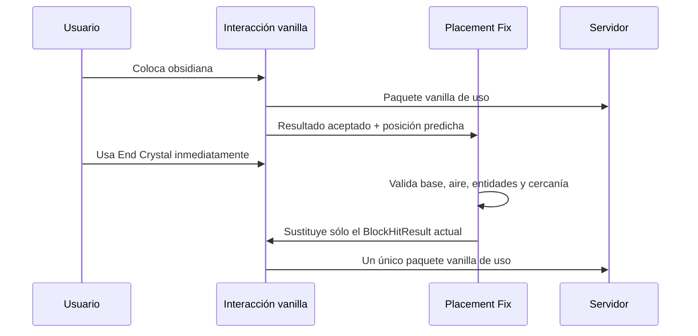

# KoHs Crystal Tweaks

Mod client-side para Fabric orientado a Crystal PvP legítimo. Esta beta unifica **KoHs Crystal Placement Fix** como una función de KoHs Crystal Tweaks y corrige problemas de colocación rápida, predicción visual y tintes del cristal.

> Estado: `1.1.0-beta.1`. Las builds están pensadas para pruebas; no automatizan clics, ataques ni colocaciones.

## Versiones de esta beta

| Minecraft | Java | Mappings / toolchain | Carpeta canónica | Artefacto |
|---|---:|---|---|---|
| 1.21.10 | 21 | Yarn `1.21.10+build.3`, Loom 1.11 | `version/1.21.10` | `kohs-crystal-tweaks-1.1.0-beta.1+mc1.21.10.jar` |
| 1.21.11 | 21 | Yarn `1.21.11+build.5`, Loom 1.13 | `version/1.21.11` | `kohs-crystal-tweaks-1.1.0-beta.1+mc1.21.11.jar` |
| 26.1.2 | 25 | Mojang official mappings, Loom 1.17 | `version/26.1.2` | `kohs-crystal-tweaks-1.1.0-beta.1+mc26.1.2.jar` |

Las carpetas anteriores a 1.21.10 se conservan como historial de compatibilidad, pero no forman parte de esta beta.

## Cambios principales

- **Placement Fix** aparece en la pestaña `Tweaks`, está activado por defecto y sólo retargetea el clic vanilla actual a la obsidiana que el cliente acaba de predecir.
- Al intentar apagar Placement Fix aparece un diálogo con `Aceptar` y `Restablecer`. `Aceptar` lo apaga; `Restablecer` lo mantiene encendido.
- La predicción local del cristal se crea únicamente después de que Minecraft acepte la interacción. Esto evita cristales fantasma por clics fallidos.
- El timeout visual adaptativo comienza en el valor configurado (12 ticks por defecto), evitando que el cristal local desaparezca antes de recibir el cristal real en conexiones con latencia.
- La validación vuelve a coincidir con vanilla: sólo obsidiana y bedrock son bases válidas; crying obsidian ya no produce una predicción falsa.
- Los tintes `Outer` y `Inner` se aplican durante el render real de cada `ModelPart`. Esto elimina las duplicaciones y colores incorrectos producidos al mutar visibilidad mientras el renderer por cola aún no había dibujado.
- En 26.1.2 se portaron también los hooks de tint, spin, flotation y static crystal que la pantalla guardaba pero el renderer todavía no consumía.
- La pantalla 1.21.10/1.21.11 ahora limita panel, botones, tabs y picker al tamaño lógico disponible para escalas GUI altas.

## Cómo funciona Placement Fix



Placement Fix no construye paquetes, no repite la interacción y no selecciona objetivos a distancia. Si el clic ya apunta a una base válida, queda intacto.

## Render de color

El modelo del End Crystal es jerárquico. La beta registra por identidad las partes `outerGlass`, `innerGlass` y `cube`; cuando Minecraft finalmente consume la cola de render, aplica el ARGB de `Outer` a los dos marcos y el de `Inner` al núcleo. La base conserva el color vanilla.

## Compilar

Cada versión es un proyecto Gradle independiente:

```powershell
cd "version\1.21.10"
.\gradlew.bat clean build --no-daemon
```

Para 26.1.2:

```powershell
$env:JAVA_HOME='C:\Program Files\Java\jdk-25.0.2'
cd "version\26.1.2"
.\gradlew.bat clean build --no-daemon
```

Los JAR remapeados aparecen en `build/libs/`. El código se compiló sin ejecutar clientes de Minecraft.

## Documentación

- [Investigación y decisiones técnicas](docs/INVESTIGATION.md)
- [Historial de cambios](CHANGELOG.md)
- [Notas de release por versión](release-notes)

Licencia declarada por el mod: All Rights Reserved.

