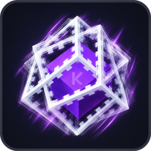

<p align="center">
  
</p>

<h1 align="center">Crystal Tweaks</h1>

<p align="center">
  A client-side Fabric mod for customizable End Crystals, responsive previews, and refined local interactions.
</p>

<p align="center">
  <a href="https://modrinth.com/mod/kohs-crystal-tweaks"></a>
  <a href="WIKI.md"></a>
  <a href="https://discord.gg/9t2VxEF7UU"></a>
  <a href="https://github.com/kerlycanelita/KoHs-Crystal-Tweaks/issues/new"></a>
</p>

## About

Crystal Tweaks brings End Crystal visual and sound controls into one compact configuration screen. It includes an interactive crystal preview, responsive layouts for high GUI scales, and local interaction refinements intended to make crystal behavior feel immediate on the client.

## Highlights

- Independent colors for the outer layer, inner layer, and crystal core.
- Rotation and floating speed controls from `0%` to `300%`.
- Custom local explosion sounds with volume and playback-speed controls.
- Interactive preview using the player's mapped Attack and Use Item controls.
- Responsive translucent interface with animated purple particles.
- Spanish localization for Minecraft language codes beginning with `es`; English for every other locale.
- Optional Mod Menu integration.

See the [Crystal Tweaks Wiki](WIKI.md) for installation, configuration, preview controls, compatibility notes, and troubleshooting.

## Requirements

- Fabric Loader `0.19.3` or newer.
- The Fabric API version matching your Minecraft installation.
- Java 21 for Minecraft 1.21–1.21.11.
- Java 25 for Minecraft 26.1–26.2.
- Mod Menu is optional but recommended for opening the configuration screen.

## Supported Minecraft versions

Crystal Tweaks provides separate JARs for:

```text
1.21, 1.21.1, 1.21.2, 1.21.3, 1.21.4, 1.21.5,
1.21.6, 1.21.7, 1.21.8, 1.21.9, 1.21.10, 1.21.11,
26.1, 26.1.1, 26.1.2, and 26.2
```

Each JAR declares one exact Minecraft version. Always download the file matching the instance where it will be installed.

## Compatibility and multiplayer

Do not load Crystal Tweaks together with the retired KoHs Crystal Tweaks mod or another mod that owns the same crystal input, prediction, or interaction paths. Competing mixins can produce inconsistent behavior even when one mod declares a higher mixin priority.

Server rules differ. Review the rules of every multiplayer server and obtain staff approval when required; this project cannot guarantee acceptance by every server or anticheat.

## Building

The default Gradle configuration targets Minecraft 26.2:

```powershell
.\gradlew.bat build
```

Prebuilt project artifacts are collected in the `versions` directory.

## Support

- [Read the wiki](WIKI.md)
- [Report a problem](https://github.com/kerlycanelita/KoHs-Crystal-Tweaks/issues/new)
- [Join the Discord server](https://discord.gg/9t2VxEF7UU)
- [Download from Modrinth](https://modrinth.com/mod/kohs-crystal-tweaks)

## License

Crystal Tweaks is maintained by **zymekoh** and distributed under the [MIT License](LICENSE).
