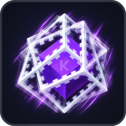

# Crystal Tweaks

[](https://github.com/kerlycanelita/KoHs-Crystal-Tweaks)
[](https://modrinth.com/mod/kohs-crystal-tweaks)
[](https://github.com/kerlycanelita/KoHs-Crystal-Tweaks/issues)
[](https://discord.gg/9t2VxEF7UU)

<p align="center">
  
</p>

**Customizable End Crystal visuals, sounds, and responsive previews.**

## About

Crystal Tweaks brings End Crystal visual and sound controls into one animated configuration screen. Version 2.3.0 adds fourteen flash styles for a destroyed crystal, rebuilds the settings into four tabs of tidy cards around a live preview, fixes your own crystals being drawn with the enemy profile while spamming, and supports Minecraft 1.21.11 through 26.3.

## What it changes

- Independent colors for the outer layer, inner layer, and crystal core.
- Glow with `0%`-`300%` power, colored reflections, its own color, and a smooth afterglow trail.
- Fourteen flash styles for a destroyed crystal, in the glow color and sized from `10%` to `300%`: explosion, skull, your own head as a pale ghost, lightning toward the players you can see, heart, star, shockwave, vortex, crown, crescent, snowflake, flower, gem, and crossed swords.
- Glow that respects walls instead of using an outline drawn through terrain.
- Separate colors, glow, and animation speeds for crystals that were not placed by you (with approximate identification).
- Rotation and floating speed controls from `0%` to `300%`.
- Custom local explosion sounds with volume and playback-speed controls.
- A settings screen in four tabs (Colors, Glow, Sound, Advanced) with an optimizer status chip, animated tabs and cards, and an interactive preview that shows your flash when you click it.
- Automatic optimizer conflict handling: interaction helpers step aside while visuals, sounds, and the preview stay active.
- Safe Crystal (switchable), optional ghost crystals (off by default), and a local Conflict Monitor.
- Spanish localization for Minecraft language codes beginning with `es`; English for every other locale.
- Optional Mod Menu integration.

Crystal Tweaks optimizes the client only: a crystal you break disappears on your screen straight away, but what reaches the server is not sped up. For that, Marlow's Crystal Optimizer is recommended (check your server's rules); with it installed, Crystal Tweaks turns all of its own optimizations off.

See the [Crystal Tweaks Wiki](docs/WIKI.md) for installation, configuration, preview controls, compatibility notes, and troubleshooting.

## Requirements

- Fabric Loader: each JAR declares the exact minimum it was built against; see
  [`gradle/versions.properties`](gradle/versions.properties).
- The Fabric API version matching your Minecraft installation.
- Java 21 for Minecraft 1.21.11.
- Java 25 for Minecraft 26.1–26.3.
- Mod Menu is optional but recommended for opening the configuration screen.

## Supported Minecraft versions

Crystal Tweaks supports **Minecraft 1.21.11 and later**. The build matrix contains these exact
targets:

```text
1.21.11, 26.1, 26.1.1, 26.1.2, 26.2, and 26.3
```

Each JAR declares one exact Minecraft version. Minecraft 1.21 through 1.21.10 were archived on
26 September 2026: their last release, 2.2.7, stays downloadable on Modrinth, and
[archive/README.md](archive/README.md) lists what was kept and how to rebuild one.

## Compatibility and multiplayer

Do not load Crystal Tweaks together with the retired KoHs Crystal Tweaks mod or another mod that owns the same crystal input, prediction, or interaction paths. Competing mixins can produce inconsistent behavior even when one mod declares a higher mixin priority.

Server rules differ. Review the rules of every multiplayer server and obtain staff approval when required; this project cannot guarantee acceptance by every server or anticheat.

Crystal Tweaks never fabricates, delays, reorders or duplicates a gameplay packet, and never changes
reach, rotation, attack cooldown or click rate. The server stays authoritative over every crystal.

Its one predictive behavior is hiding a crystal you just hit before the server confirms the break,
which is latency compensation for an action you already performed. It is constrained to hits the
server is expected to accept.

See [docs/audits/LEGITIMACY_AUDIT.md](docs/audits/LEGITIMACY_AUDIT.md) for the full client/server boundary of every feature,
including the one place where the mod changes which packets are sent: Safe Crystal, which you can switch off.

## Building

Every supported Minecraft version has its own row in [`gradle/versions.properties`](gradle/versions.properties),
holding the Fabric Loader, Fabric API, Mod Menu and Java release that target is built against. Pick a
target with `-Pmc`:

```powershell
.\gradlew.bat build -Pmc=26.1.2
```

To build the whole matrix, collect the JARs into `versions/` and refresh `CHECKSUMS.sha256`:

```powershell
.\tools\build-all.ps1
```

See [docs/RELEASING.md](docs/RELEASING.md) for the full release process and for how to add a new Minecraft
version.

## Support

- [Read the wiki](docs/WIKI.md)
- [Report a problem](https://github.com/kerlycanelita/KoHs-Crystal-Tweaks/issues/new)
- [Join the Discord server](https://discord.gg/9t2VxEF7UU)
- [Download from Modrinth](https://modrinth.com/mod/kohs-crystal-tweaks)

## Repository layout

| Location | Contents |
| --- | --- |
| `src/` | Shared client sources and the version-specific rendering adapters. |
| `gradle/` | Wrapper and the exact Minecraft dependency matrix. |
| `docs/` | Wiki, release workflow, audits and version notes. |
| `tools/` | Build, artifact, Mixin and appearance checks. |
| `archive/` | Code and matrix rows of the archived 1.21–1.21.10 targets; never compiled. |
| `versions/`, `dist/` | Local generated JAR collections; excluded from Git. |

Start with the [documentation index](docs/README.md). Build output and local
Minecraft instances remain outside Git; keep installable JARs out of the source tree.

## License

Crystal Tweaks is maintained by **zymekoh** and distributed under the [MIT License](LICENSE).
